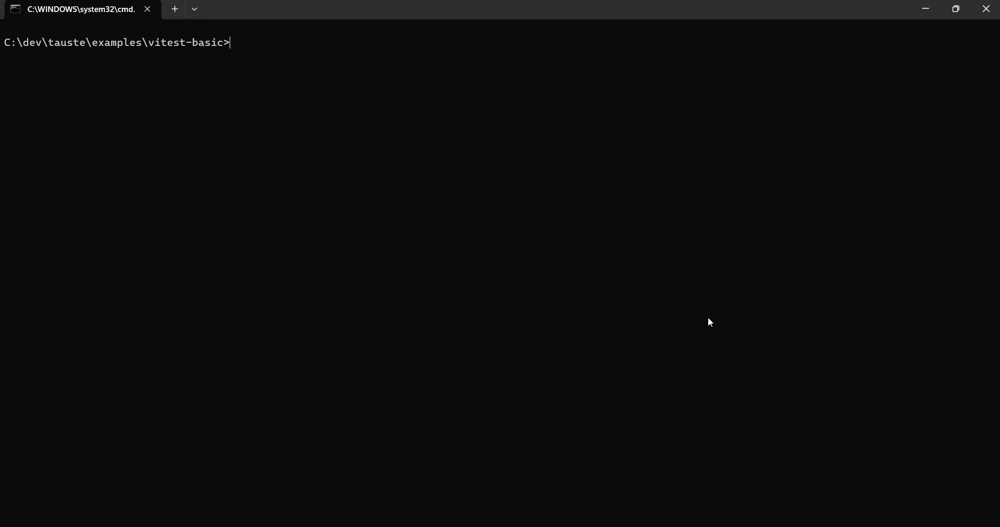

# Tautest

[](https://www.npmjs.com/package/tautest)
[](https://www.npmjs.com/package/@tautest/core)
[](LICENSE)
[](https://github.com/canblmz1/tautest/actions/workflows/release-readiness.yml)
[](package.json)

Tautest runs mutation testing only on lines a PR changed, then reports surviving mutants in a PR-friendly format.

It uses StrykerJS as the mutation engine. Tautest adds changed-line scoping from `git diff`, Markdown/JSON reports, deterministic fix prompts for Claude Code, Cursor, Codex, OpenCode, or humans, and optional GitHub PR sticky comments.

## Demo

Regular tests pass, but Tautest finds a surviving mutant that the tests missed. After adding the missing boundary test, the mutation score improves to 100%.



## Why Tautest?

Passing tests can still miss behavior. Coverage tells you that code ran; mutation testing checks whether tests fail when meaningful changes are introduced.

Tautest focuses that feedback on the code changed in a pull request, so reviewers and coding agents can act on a smaller, more relevant report.

## What Tautest does

- Scopes mutation testing to changed source lines from `git diff`.
- Runs StrykerJS as the mutation testing engine.
- Parses surviving mutants into review-friendly findings.
- Writes Markdown, JSON, and terminal reports.
- Generates AI-ready fix prompts.
- Can post GitHub PR comments.
- Writes a GitHub job summary when used in GitHub Actions.

## What Tautest does not do

- Does not implement its own mutation engine.
- Does not call LLM APIs.
- Does not detect which lines were written by AI.
- Does not prove tests are perfect.
- Does not fully support monorepos in v1.

Fix prompts are generated Markdown files. They are grounded in the actual surviving mutants and can be pasted into any coding agent or used manually. No LLM is called at generation time.

## Relationship to StrykerJS

Tautest uses StrykerJS as the mutation testing engine. StrykerJS performs the mutation testing, provides the mutators, and integrates with test runners.

Tautest is the workflow layer around PR scoping, reports, prompts, and GitHub feedback.

## Install

### Vitest

```bash
pnpm add -D tautest @stryker-mutator/core @stryker-mutator/vitest-runner
pnpm exec tautest init --yes --runner vitest --no-install
pnpm exec tautest doctor
pnpm exec tautest run --base origin/main
```

### Jest beta

```bash
pnpm add -D tautest @stryker-mutator/core @stryker-mutator/jest-runner
pnpm exec tautest init --yes --runner jest --no-install
```

### npx

```bash
npx tautest@latest --help
```

## Quickstart

```bash
pnpm exec tautest doctor
pnpm exec tautest run --base origin/main
pnpm exec tautest prompt --style codex
```

The normal loop is:

1. Run your regular test suite.
2. Run Tautest against the pull request base.
3. Inspect `.tautest/report.md`.
4. Use `.tautest/fix-prompt.md` to add or strengthen tests.
5. Re-run the test suite and Tautest.

See [Quickstart](docs/QUICKSTART.md).

## CLI usage

```bash
tautest init --yes --runner vitest --no-install
tautest doctor
tautest run --base origin/main --threshold 60
tautest prompt --style codex
tautest report
```

Common options:

- `--base <ref>`: Git base ref used for changed-line detection.
- `--threshold <number>`: minimum mutation score.
- `--report-dir <dir>`: output directory, default `.tautest`.
- `--prompt-style <style>`: `agent`, `human`, `claude-code`, `cursor`, `codex`, or `opencode`.
- `--dry-run`: show mutate scope without running StrykerJS.
- `--json`: print machine-readable run output.

Exit codes:

- `0`: success and threshold passed.
- `1`: ran successfully but score was below threshold.
- `2`: no changed production source files.
- `10`: config error.
- `11`: detection error.
- `12`: Stryker error.
- `20`: git error.

See [CLI reference](docs/CLI_REFERENCE.md).

## GitHub Action usage

```yaml
name: Tautest

on:
  pull_request:

permissions:
  contents: read
  pull-requests: write

jobs:
  tautest:
    runs-on: ubuntu-latest
    steps:
      - uses: actions/checkout@v4
        with:
          fetch-depth: 0

      - uses: actions/setup-node@v4
        with:
          node-version: 20

      - uses: pnpm/action-setup@v4
        with:
          version: 10

      - run: pnpm install --frozen-lockfile
      - run: pnpm build

      - uses: canblmz1/tautest/packages/github-action@v1
        with:
          base: ${{ github.base_ref }}
          threshold: 60
          comment: changes
          cache: true
```

Notes:

- The v1 action currently ships from this monorepo path.
- `fetch-depth: 0` is required.
- `pull-requests: write` is required for sticky comments.
- The Node 20 action runtime warning is a post-v1 roadmap item.

See [GitHub Action docs](docs/GITHUB_ACTION.md).

## Example output

```text
Tautest: MIXED (75.00%, threshold 60.00%)
Killed: 3 | Survived: 1 | No coverage: 0

Top surviving mutants:
- src/discount.ts:2 EqualityOperator
```

After the missing boundary test is added:

```text
Tautest: STRONG (100.00%, threshold 60.00%)
Killed: 4 | Survived: 0
```

## AI fix prompt workflow

1. Run Tautest.
2. Open `.tautest/fix-prompt.md`.
3. Paste it into Claude Code, Cursor, Codex, OpenCode, or use it yourself.
4. Add or strengthen tests only.
5. Re-run the normal test suite.
6. Re-run Tautest.

Agent workflow docs:

- [Claude Code workflow](docs/CLAUDE_CODE_WORKFLOW.md)
- [Cursor workflow](docs/CURSOR_WORKFLOW.md)
- [Codex workflow](docs/CODEX_WORKFLOW.md)
- [OpenCode workflow](docs/OPENCODE_WORKFLOW.md)

## Example projects

- [examples/vitest-basic](examples/vitest-basic)
- [examples/vitest-react](examples/vitest-react)
- [examples/jest-basic](examples/jest-basic)

## Generated files

Tautest writes run outputs to `.tautest/` by default:

- `.tautest/report.md`
- `.tautest/report.json`
- `.tautest/fix-prompt.md`
- `.tautest/stryker-incremental.json`

GitHub Actions also writes a job summary with the mutation score and top surviving mutants when summary output is available.

These files are generated artifacts and normally should not be committed.

## Validated before v1

- `tautest@1.0.0` published.
- `@tautest/core@1.0.0` published.
- Main Release Readiness workflow passed.
- Source-changing PR smoke passed.
- Mutation run completed in GitHub Actions.
- JSON output parsed.
- Sticky PR comment create/update verified.
- Artifact upload verified.

## Limitations

- Tautest uses StrykerJS; it is not a mutation engine.
- Jest support is beta.
- Monorepo support is detect-and-warn in v1.
- Runtime depends on project size and test speed.
- GitHub Action currently uses Node 20; Node 24 migration is planned.
- Cache hit was not proven in v1 smoke, but graceful cache handling was validated.
- Tautest does not classify AI-written tests with certainty.

See [limitations](docs/LIMITATIONS.md).

## Roadmap

- Node 24 action runtime migration.
- Better cache observability.
- Monorepo beta.
- Standalone GitHub Action repository, maybe.
- PR line annotations.
- More Jest fixtures.

See [roadmap](docs/ROADMAP.md).

## Contributing

```bash
pnpm install --frozen-lockfile
pnpm typecheck
pnpm lint
pnpm test
pnpm build
```

Small reproducible examples are the most useful issue reports. Include your test runner, package manager, Node version, StrykerJS version, and generated `.tautest/report.json` when possible.

## License

MIT.
