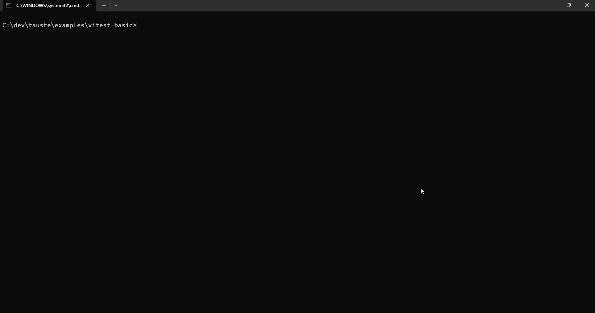

# Tautest

[](https://www.npmjs.com/package/tautest)
[](https://www.npmjs.com/package/@tautest/core)
[](LICENSE)
[](https://github.com/canblmz1/tautest/actions/workflows/release-readiness.yml)
[](package.json)

Mutation testing for changed code in pull requests, powered by StrykerJS.

Coverage shows that changed code ran. Tautest checks whether tests fail when changed behavior is mutated.

Tautest is a PR mutation quality gate for JavaScript and TypeScript projects. It uses StrykerJS as the mutation engine, scopes mutation testing to changed source lines from `git diff`, and turns surviving mutants into review-ready reports, GitHub feedback, and deterministic test-fix prompts for Claude Code, Cursor, Codex, OpenCode, or humans.

## Current support tiers

| Area | Tier | Notes |
| --- | --- | --- |
| Vitest JS/TS projects | Supported | Primary workflow for `tautest run`, reports, prompts, and GitHub feedback. |
| Jest JS/TS projects | Beta | CommonJS, native ESM, and Babel TypeScript fixtures are covered; heavily customized transforms can need explicit Stryker/Jest configuration. |
| pnpm and `package.json` workspaces | Beta | Workspace mode plans and sequentially runs selected packages; full dependency-graph scheduling is future work. |
| Python and Java parser work | Alpha groundwork | Parser and runner-adapter experiments only; `tautest run` execution remains JS/TS through StrykerJS. |
| Reliability helpers | MVP | `predict-flaky`, `watch`, `scaffold`, `time-travel init`, and `chaos` are local-first advisory tools. |
| LLM provider calls | Opt-in only | Fix prompts are deterministic local artifacts unless `tautest prompt --suggest` is explicitly configured. |
| Hosted dashboard | Out of scope | Tautest is local-first CLI and CI tooling. |

## Demo

Regular tests pass, but Tautest finds a surviving mutant that the tests missed. After adding the missing boundary test, the mutation score improves to 100%.



Want to try the same flow locally? See the [copy-paste demo](docs/DEMO.md).

If you have the CLI installed, `tautest demo` prints the same short demo path. From a Tautest repository checkout, `tautest demo --run` runs the fixture and restores it afterward.

```bash
pnpm exec tautest demo
pnpm exec tautest demo --run
```

## Why Tautest?

Passing tests can still miss changed behavior. Line coverage can tell you that a changed branch or function executed, but it cannot tell you whether the test suite would fail if that behavior were subtly wrong.

Tautest focuses mutation testing on the code changed in a pull request. The result is a smaller, more relevant signal for code review:

- Which changed lines still have surviving mutants?
- What test behavior is probably missing?
- Should this PR pass the mutation quality threshold?
- What small test-only task should a human or coding agent do next?

See [Why Tautest?](docs/WHY_TAUTEST.md) for the longer positioning and comparison with StrykerJS, coverage gates, and coding agents.

## What Tautest does

- Scopes mutation testing to changed source lines from `git diff`.
- Runs StrykerJS as the mutation testing engine.
- Parses surviving mutants into review-friendly findings.
- Summarizes patch-scoped mutation quality for pull requests.
- Writes Markdown, JSON, and terminal reports.
- Can generate a local static HTML report viewer.
- Generates AI-ready fix prompts.
- Can post GitHub PR comments.
- Writes a GitHub job summary when used in GitHub Actions.

## What Tautest does not do

- Does not implement its own mutation engine.
- Does not call LLM APIs by default.
- Does not detect which lines were written by AI.
- Does not replace StrykerJS, coverage tools, or normal test suites.
- Does not prove tests are perfect.
- Does not fully support monorepos in v1.

Fix prompts are generated Markdown files. They are grounded in the actual surviving mutants and can be pasted into any coding agent or used manually. No LLM is called at generation time unless you explicitly opt into the external-command suggestion flow.

## Relationship to StrykerJS

Tautest uses StrykerJS as the mutation testing engine. StrykerJS performs the mutation testing, provides the mutators, and integrates with test runners.

Tautest is the workflow layer around PR scoping, reports, prompts, and GitHub feedback. If you already run StrykerJS directly on every pull request and your reviewers or agents reliably act on the raw reports, Tautest may not add much. It is mainly for teams that want mutation testing to behave like a changed-code PR quality gate.

## How Tautest is different

Tautest is not different because it invents new mutation testing. It is different because it packages StrykerJS results for the pull request loop:

- Compared with running StrykerJS directly, Tautest starts from the Git diff and focuses on changed source lines.
- Compared with coverage gates, Tautest checks whether changed behavior is defended by tests, not just whether changed lines executed.
- Compared with handing raw reports to an AI agent, Tautest creates a smaller deterministic task packet: these changed lines survived mutation, strengthen tests only, do not change production code, then rerun validation.

Read the detailed explanation in [Why Tautest?](docs/WHY_TAUTEST.md) and the [Positioning FAQ](docs/POSITIONING_FAQ.md).

## Install

Tautest runs the Stryker installed in your project (`@stryker-mutator/core` 9.6.1 or 10.x) and needs Node 22 or newer. Vitest 5 cannot be used yet: `@stryker-mutator/vitest-runner` 10.0.0 and older run no tests for mutants on it ([stryker-mutator/stryker-js#6210](https://github.com/stryker-mutator/stryker-js/issues/6210)). `tautest doctor` flags that combination and `tautest run` refuses to score it; keep `vitest` on `^4` until the runner supports Vitest 5.

### Vitest

```bash
pnpm add -D tautest @stryker-mutator/core @stryker-mutator/vitest-runner
pnpm exec tautest init --yes --runner vitest --no-install
pnpm exec tautest doctor
pnpm exec tautest run --base origin/main
```

### Jest

```bash
pnpm add -D tautest @stryker-mutator/core @stryker-mutator/jest-runner
pnpm exec tautest init --yes --runner jest --no-install
```

Tested Jest fixture paths include CommonJS, native ESM, and Babel-powered TypeScript. For non-root Jest config files, set `stryker.jestConfigFile` in `tautest.config.*`.

### npx

```bash
npx tautest@latest --help
```

## Quickstart

First 15 minutes:

```bash
pnpm add -D tautest @stryker-mutator/core @stryker-mutator/vitest-runner
pnpm exec tautest init --yes --runner vitest --no-install
pnpm exec tautest doctor
pnpm exec tautest run --base origin/main
pnpm exec tautest prompt --style codex
```

The normal loop is:

1. Run your regular test suite.
2. Run Tautest against the pull request base.
3. Inspect `.tautest/report.md`.
4. Use `.tautest/fix-prompt.md` to add or strengthen tests.
5. Re-run the test suite and Tautest.

See [Quickstart](docs/QUICKSTART.md).
See [Package manager support](docs/PACKAGE_MANAGERS.md).

## CLI usage

```bash
tautest demo
tautest demo --run
tautest init --yes --runner vitest --no-install
tautest doctor
tautest run --base origin/main --threshold 60
tautest prompt --style codex
tautest report
tautest report --html
```

Experimental commands outside the pull request workflow: `tautest watch`, `tautest predict-flaky`, `tautest scaffold`, `tautest time-travel` and `tautest chaos`. They are not part of the compatibility matrix; see the [CLI reference](docs/CLI_REFERENCE.md).

Common options:

- `--base <ref>`: Git base ref used for changed-line detection.
- `--threshold <number>`: minimum mutation score.
- `--report-dir <dir>`: output directory, default `.tautest`.
- `--prompt-style <style>`: `agent`, `human`, `claude-code`, `cursor`, `codex`, or `opencode`.
- `--workspace`: plan or run selected workspace packages in a monorepo.
- `--workspace-path <path>`: run from a workspace/package directory inside the current repository.
- `--max-changed-lines <number>`: fail before StrykerJS runs if the changed production line count exceeds the budget.
- `--dry-run`: preview included/excluded changed files and mutate scope without running StrykerJS.
- `--json`: print machine-readable run output.

Exit codes:

- `0`: success and threshold passed.
- `1`: ran successfully but score was below threshold.
- `2`: nothing to mutation-test: no changed production source files, or Stryker generated no mutants for the changed lines.
- `10`: config error.
- `11`: detection error.
- `12`: Stryker error, including a run whose surviving mutants executed zero tests (see [Troubleshooting](docs/TROUBLESHOOTING.md#surviving-mutants-executed-zero-tests)).
- `20`: git error.

See [CLI reference](docs/CLI_REFERENCE.md).

## GitHub Action usage

```yaml
name: Tautest

on:
  pull_request:

permissions:
  contents: read
  pull-requests: write

jobs:
  tautest:
    runs-on: ubuntu-latest
    steps:
      - uses: actions/checkout@v4
        with:
          fetch-depth: 0

      - uses: actions/setup-node@v4
        with:
          node-version: 22

      - uses: pnpm/action-setup@v4
        with:
          version: 10

      - run: pnpm install --frozen-lockfile
      - run: pnpm build

      - uses: canblmz1/tautest/packages/github-action@v1
        with:
          base: ${{ github.base_ref }}
          threshold: 60
          comment: changes
          annotations: survivors
          cache: true
```

Notes:

- The v1 action currently ships from this monorepo path.
- `fetch-depth: 0` is required.
- `pull-requests: write` is required for sticky comments.
- `annotations: survivors` adds capped line annotations in the Checks UI.
- `max-files` and `max-changed-lines` can cap expensive mutation runs in CI.
- New to Tautest? Set `fail-on-threshold: false` for about a week so the team can review real-versus-equivalent survivors before it blocks merges. See [Advisory First Week](docs/GITHUB_ACTION.md#advisory-first-week).

See [GitHub Action docs](docs/GITHUB_ACTION.md).

## Example output

```text
Tautest: MIXED (75.00%, threshold 60.00%)
Killed: 3 | Survived: 1 | No coverage: 0

Top surviving mutants:
- src/discount.ts:2 EqualityOperator - The exact boundary value 65 is not protected by a test that distinguishes the original expression from the mutant.
```

After the missing boundary test is added:

```text
Tautest: STRONG (100.00%, threshold 60.00%)
Killed: 4 | Survived: 0
```

## AI fix prompt workflow

1. Run Tautest.
2. Open `.tautest/fix-prompt.md`.
3. Paste it into Claude Code, Cursor, Codex, OpenCode, or use it yourself.
4. Add or strengthen tests only.
5. Re-run the normal test suite.
6. Re-run Tautest.

Agent workflow docs:

- [Agent workflow packs](docs/AGENT_WORKFLOWS.md)
- [Optional LLM suggestions](docs/LLM_SUGGESTIONS.md)
- [Claude Code workflow](docs/CLAUDE_CODE_WORKFLOW.md)
- [Cursor workflow](docs/CURSOR_WORKFLOW.md)
- [Codex workflow](docs/CODEX_WORKFLOW.md)
- [OpenCode workflow](docs/OPENCODE_WORKFLOW.md)

## Example projects

- [examples/vitest-basic](examples/vitest-basic)
- [examples/vitest-react](examples/vitest-react)
- [examples/jest-basic](examples/jest-basic)
- [Framework recipes for Next.js, Vue, Turborepo, and Nx](docs/FRAMEWORK_RECIPES.md)

## Generated files

Tautest writes run outputs to `.tautest/` by default:

- `.tautest/report.md`
- `.tautest/report.json`
- `.tautest/report.html` when `tautest report --html` is used
- `.tautest/fix-prompt.md`
- `.tautest/llm-suggestion.md` when `tautest prompt --suggest` is explicitly enabled
- `.tautest/stryker-incremental.json`
- `.tautest/flaky-report.json` and `.tautest/flaky-report.md` from `tautest predict-flaky`
- `.tautest/watch-report.json` and `.tautest/watch-report.md` from `tautest watch`
- `.tautest/chaos-report.json` and `.tautest/chaos-report.md` from `tautest chaos`

The machine-readable `.tautest/report.json` file uses schema version `1`. See [docs/report.schema.json](docs/report.schema.json) for the JSON Schema contract.

IDE and editor integrations should use `.tautest/report.json` as the source of truth. See [IDE integration contract](docs/IDE_INTEGRATION.md).

GitHub Actions also writes a job summary with the mutation score and top surviving mutants when summary output is available.

These files are generated artifacts and normally should not be committed.

## Validated on real pull requests

Tautest 2.0 was run on merged pull requests of three open source libraries, next to a full-file Stryker run on the same files (Stryker 10, each project's own Vitest):

| Pull request | Changed-line mutants | Tautest | Time (Tautest / full file) |
| --- | --- | --- | --- |
| [unjs/ufo#313](https://github.com/unjs/ufo/pull/313): `withBase`/`withoutBase` prefix fix | 25 | STRONG 92%, 2 survivors | 63s / 196s |
| [unjs/defu#156](https://github.com/unjs/defu/pull/156): `__proto__` pollution fix | 1 | STRONG 100% | 13s / 28s |
| [unjs/destr#136](https://github.com/unjs/destr/pull/136): faster string checks | 39 | MIXED 77%, 9 survivors | 27s / 38s |

- Every mutant Tautest tested got the same status as in the full-file run. It covered 65 of the 71 mutants that touch the changed lines; the 6 it left out also span unchanged lines, and all 6 were killed.
- The two ufo survivors are a real gap: no test called `withBase` with a query string right after the base, so dropping the new `nextChar === "?"` check, which turns `withBase("/api?x=1", "/api")` into `/api/api?x=1`, went unnoticed.
- Six of the nine destr survivors only switch off the new fast path, which then falls back to the general path with the same result: mutation testing cannot tell a performance-only branch from a missing test. The other three change results for inputs the tests did not cover, such as `'abc"'`.

## Validated before v1

- `tautest@1.0.0` published.
- `@tautest/core@1.0.0` published.
- Main Release Readiness workflow passed.
- Source-changing PR smoke passed.
- Mutation run completed in GitHub Actions.
- JSON output parsed.
- Sticky PR comment create/update verified.
- Artifact upload verified.

## Limitations

- Tautest uses StrykerJS; it is not a mutation engine.
- Tested Jest paths cover CommonJS, native ESM, and Babel TypeScript. Heavily customized transforms may still need explicit Stryker/Jest config.
- Monorepo support is a workspace execution beta for pnpm and package.json workspaces.
- Python and Java support are parser-only alpha groundwork, not `tautest run` execution paths.
- Runtime depends on project size and test speed.
- CLI support is validated on Node 22 and 24. The GitHub Action runs on the Node 24 action runtime.
- Vitest 5 is not usable with `@stryker-mutator/vitest-runner` 10.0.0 or older (stryker-mutator/stryker-js#6210); see [Install](#install).
- Cache hit was not proven in v1 smoke, but graceful cache handling was validated.
- Tautest does not classify AI-written tests with certainty.

See [limitations](docs/LIMITATIONS.md).
See [multi-language alpha](docs/MULTI_LANGUAGE_ALPHA.md) for runner plugin groundwork.

## Trust and safety

Tautest is local-first, does not call LLM APIs by default, and writes generated artifacts under `.tautest/`. See [trust and safety](docs/TRUST_AND_SAFETY.md) for CI permissions, token handling, generated file boundaries, optional provider suggestions, and safe agent-use rules.

## Roadmap

- Vitest 5, as soon as `@stryker-mutator/vitest-runner` runs tests on it ([stryker-mutator/stryker-js#6210](https://github.com/stryker-mutator/stryker-js/issues/6210)). The root cause is a Vitest 5 test-name-separator change the runner does not yet account for; a fix is proposed but unreleased in [stryker-js#6214](https://github.com/stryker-mutator/stryker-js/pull/6214), with a complementary "never report a zero-test run as survived" fix in [stryker-js#6146](https://github.com/stryker-mutator/stryker-js/pull/6146). Re-test once both land in a release; the compatibility matrix will show when it's safe to lift this guard.
- Workspace mode: read each package's Stryker `mutate` list, as single-package runs already do.
- Jest in the compatibility matrix, and more Jest fixtures.
- Better cache observability.
- Richer PR review annotations beyond survivor workflow annotations.

See [roadmap](docs/ROADMAP.md).

## Contributing

See [CONTRIBUTING.md](CONTRIBUTING.md) for the local development flow.

```bash
pnpm install --frozen-lockfile
pnpm typecheck
pnpm lint
pnpm test
pnpm build
```

Small reproducible examples are the most useful issue reports. Include your test runner, package manager, Node version, StrykerJS version, and generated `.tautest/report.json` when possible.

Security reports should follow [SECURITY.md](SECURITY.md).

## License

MIT.
